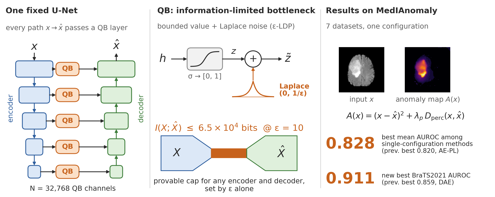
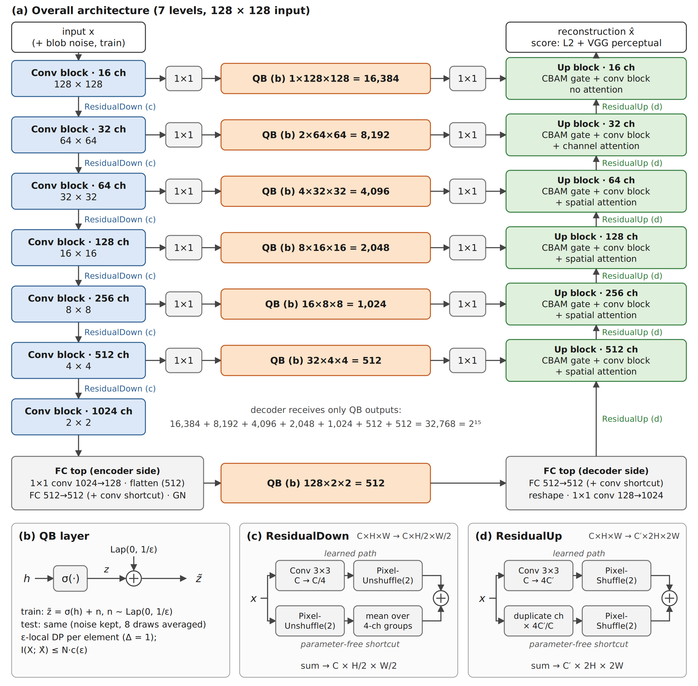
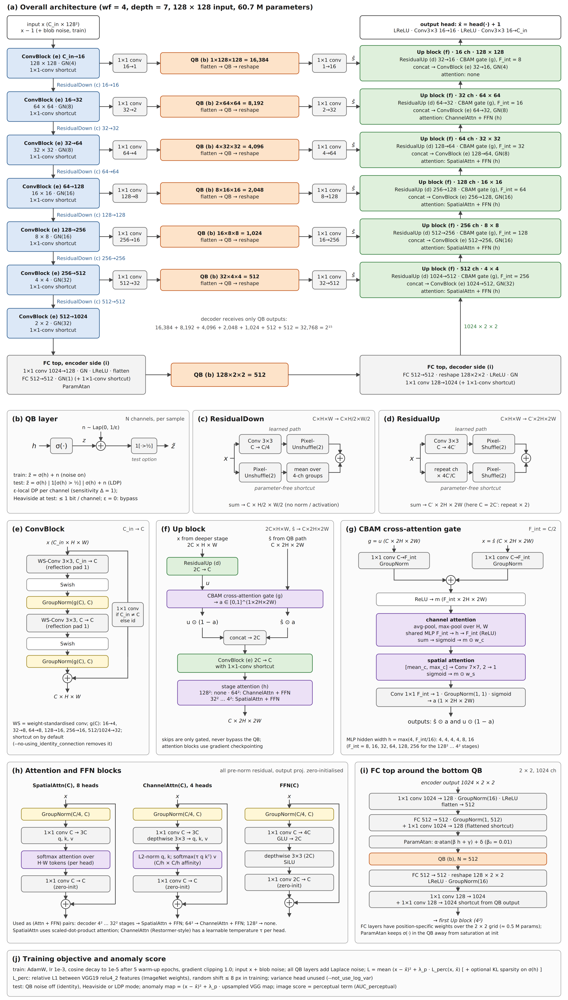

# Quasi-Binarized Autoencoders (QBAE)

**Quasi-Binarized Autoencoders: An Architecture-Independent Information Budget for Medical Image Anomaly Detection**

Shouhei Hanaoka, Takeharu Yoshikawa, Osamu Abe (The University of Tokyo Hospital) — research code, manuscript in preparation.



This repository is a fork of the [MedIAnomaly](https://github.com/caiyu6666/MedIAnomaly) benchmark.
The QBAE model (`-m unet-qb`) is implemented in [`reconstruction/`](./reconstruction); all other
methods, the datasets and the evaluation protocol are those of the original benchmark.
The original README is kept as [README_MedIAnomaly.md](./README_MedIAnomaly.md).

---

## Idea

In an autoencoder for anomaly detection, the information that can reach the decoder must be limited, otherwise
the network learns an identity mapping and reconstructs anomalies as well as normal tissue. Usually this limit is
imposed through the *architecture* (a narrow latent, no skip connections), which also limits how expressive the
encoder and decoder can be.

QBAE imposes the limit with a **quasi-binarizing (QB) layer** instead. Every path from the encoder to the decoder,
including every U-Net skip connection, passes through a QB layer:

$$
\tilde z = \sigma(h) + n,\qquad n \sim \mathrm{Laplace}(0, 1/\varepsilon)\quad\text{(training)}
$$

- $\sigma(h)\in[0,1]$, so each channel has sensitivity 1 and the noise is the Laplace mechanism:
  each channel is $\varepsilon$-locally differentially private.
- The information passed to the decoder is bounded per channel, $I(X;\hat X)\le\sum_i C_i$, independently of
  how large or deep the encoder and decoder are.
- At test time the noise is switched off. Optionally a Heaviside $\mathbb 1[\sigma(h)>\tfrac12]$ is applied,
  so that each channel carries at most one bit.

Because the bottleneck is set by $\varepsilon$ and the number of QB channels rather than by the architecture,
the U-Net can use full-resolution skips, attention and DC-AE residual up/down-sampling without leaking identity.

## Network

<p align="center"></p>

Overview of the 7-level network used in the paper (`--depth 7 --skip_latent_sizes 1,2,4,8,16,32 --latent_size_with_noise 512 --top_mixer fc --top_mid_channels 128`; 128 × 128 input, 60.7 M parameters). The decoder receives only QB outputs:
16,384 + 8,192 + 4,096 + 2,048 + 1,024 + 512 (skips) + 512 (bottom) = **32,768 QB channels**.
[PDF](./images/qbae_network.pdf) · [SVG](./images/qbae_network.svg)

<details>
<summary><b>Detailed figure (all layers and settings)</b></summary>

<p align="center"></p>

[PDF](./images/qbae_network_detailed.pdf) · [SVG](./images/qbae_network_detailed.svg)

</details>

| Component | Implementation | Where |
|---|---|---|
| QB layer | sigmoid → + Laplace(0, 1/ε) (train) → identity / Heaviside / noisy (test) | `networks/base_units/quasibinarize.py` |
| Encoder / decoder blocks | WS-Conv 3×3 → Swish → GroupNorm, ×2, + identity (1×1 conv if channels change) | `UNetConvBlock` |
| Down / up-sampling | DC-AE residual autoencoding (PixelUnshuffle + channel averaging / channel repeat + PixelShuffle) | `networks/base_units/dcae_residual_autoencoding.py` |
| Skip path | 1×1 conv → QB (1, 2, 4, 8, 16, 32 ch/pixel at 128² … 4²) → 1×1 conv | `UNet_QB.forward_down` |
| Skip / up-path mixing | CBAM cross-attention gate: skip ⊙ a, up ⊙ (1 − a) | `CBAMCrossAttentionGate` |
| Decoder attention | 4² … 32²: SpatialAttn + FFN; 64²: ChannelAttn + FFN; 128²: none | `networks/base_units/attn_block.py` |
| Bottom | 2 × 2 × 1024 → 1×1 conv → flatten → FC 512→512 (+ conv shortcut) → GN → ParamAtan → QB (512) → FC 512→512 → reshape → 1×1 conv (+ shortcut) | `UNet_QB` (`--top_mixer fc`); the 5-level variant uses an attention mixer around a 32,768-channel QB (`--top_mixer attn`) |
| Loss | (x − x̂)² + λ_p · relative-L1 VGG19 relu4_2 perceptual loss | `AEU_Perceptual_QBLoss` |

The figures are generated from the code by `tools/make_fig_overview.py` and `tools/make_fig_detailed.py`
(requires `cairosvg`).

## Setup

- Python ≥ 3.10, PyTorch ≥ 2.1 (CUDA), torchvision, scikit-learn, scipy, medpy, opencv-python, SimpleITK, wandb
- Optional (`--full_eval` only): `constriction`, `thop`

Download and place the seven pre-processed datasets in `~/MedIAnomaly-Data/` as described in
[README_MedIAnomaly.md](./README_MedIAnomaly.md#data-preparation).
Training curves and metrics are logged to Weights & Biases (`wandb login` beforehand; project name `-p`).

## Train and evaluate

```bash
cd reconstruction
python train.py -d brats -m unet-qb -g 0 \
    --input-size 128 --wf 4 \
    --latent_size_with_noise 32768 \
    --epsilon 100 \
    --noise 1.0 \
    --not_use_log_var \
    --perceptual_loss_weight 1 \
    -bs 64 --train-seed 0
```

The values above are an example (ε = 100 is the current default choice; the input-noise strength is still being tuned).
`-d` is one of `rsna`, `vin`, `brain`, `lag`, `isic`, `c16`, `brats`. The number of epochs is set per dataset
in `options.py`; evaluation runs every `--train-eval-freq` epochs (default 25).

### Main options

| Option | Default | Meaning |
|---|---|---|
| `--epsilon` | 0 | ε of the QB layers (Laplace scale 1/ε). `0` bypasses the QB layers; a very large value (e.g. `1e8`) keeps the sigmoid but removes the noise |
| `--latent_size_with_noise` | 4096 | number of bottom QB channels (must be a multiple of 64 for 128² input); 32,768 = 512 × 8 × 8 |
| `--noise` | 0.0 | strength of the DAE-style blob noise added to the input during training (relative to the image std); `0` disables it |
| `--heaviside` | off | apply the Heaviside in every QB layer, also during training (evaluation always reports both modes) |
| `--attention_gate` / `--no-attention_gate` | on | CBAM cross-attention gate between skip and up path (default since v32; without it training can diverge) |
| `--not_use_log_var` | off | disable the per-pixel variance head (used in all reported runs) |
| `--use_KL_divergence`, `--rho` | off, 0.05 | KL sparsity penalty on the mean QB activation (weight `--firing_rate_cost_weight`) |
| `--using_identity_connection` / `--no-using_identity_connection` | on | identity shortcut in the conv blocks |
| `--top_mixer {attn,fc}` | `attn` | attention mixer around the bottom QB, or the legacy dense FC bottleneck (v30) |
| `--top_pos {abs,none}` | `abs` | learned absolute positional embedding added to the 8 × 8 tokens before and after the bottom QB (v32; `none` = v31) |
| `--depth`, `--max_channels`, `--skip_latent_sizes`, `--top_mid_channels` | 5, 0, `1,2,4,8`, 32 | number of U-Net levels, cap on the channel width, skip QB channels per pixel (finest first), width entering the FC top mixer (v32). 7-level variant with the same 63,488 QB channels (skip budgets halve per level, the rest goes through a flatten + FC at 2 × 2): `--depth 7 --skip_latent_sizes 1,2,4,8,16,32 --latent_size_with_noise 31232 --top_mixer fc --top_mid_channels 128` |
| `--top_attn_depth` | 2 | number of (SpatialAttn + FFN) blocks before and after the bottom QB |
| `--norm_type {group,batch}` | `group` | normalisation in the bottom mixer and attention gates (GroupNorm is per sample) |
| `--perceptual_bf16` / `--no-perceptual_bf16` | on | run VGG19 in bf16 autocast during training (evaluation is fp32) |
| `--test_batch_size` | 64 | evaluation batch size (results are batch-size independent) |
| `--num_workers` | 4 | DataLoader workers (`0` if the cluster restricts shared memory) |
| `--grad_clip` | 1.0 | clip the global gradient norm (0 = off); `train/grad_norm_mean`, `train/grad_norm_max`, `train/grad_clipped_fraction` are logged (v32) |
| `--lr_schedule {cosine,const}`, `--warmup_epochs`, `--lr_min` | `cosine`, 5, 1e-5 | learning-rate schedule (v33): linear warm-up, then cosine decay from `--train-lr` to `--lr_min`; `const` = v32 and earlier. `train/lr` is logged |
| `--ldp_samples` | 8 | number of independent noise draws averaged for the LDP (noisy) test-time readout (v32) |
| `--full_eval` | off | additionally run range coding, PNG residual coding, one-class / few-shot classifiers and t-SNE (slow) |

### Reported metrics

Each evaluation logs, among others (prefix `val/` in wandb):

- `AUC_perceptual`: image-level AUROC from the perceptual term of the anomaly score (main metric).
- `AUC_perceptual_heaviside`, `AUC_perceptual_ldp`: the same with Heaviside (≤ 1 bit/channel) or noisy (LDP) test-time QB.
- `AUC_perceptual_ldp_avg`, `AP_perceptual_ldp_avg` (and `PixAP_ldp_avg`, `BestDice_ldp_avg` for BraTS): LDP readout with the anomaly score averaged over `--ldp_samples` noise draws (v32).
- `AUC`, `AP`, `AUC_l2`, `AP_l2`: from the full anomaly map or from the L2 term only.
- BraTS only: `PixAUC`, `PixAP`, `BestDice` (and `_l2`, `_heaviside` variants).
- Heaviside information budget on the test set (v32): `real_firing_rate` (mean fraction of QB channels with σ(h) > ½),
  `heaviside_budget_bits` = Σ_i h₂(p_i) and `heaviside_budget_bits_jensen` = N·h₂(p̄), upper bounds in bits on the
  information carried by the Heaviside readout (p_i: firing frequency of channel i over the test images);
  `dead_channel_fraction`; and the same with prefix `normal_` computed on normal test images only.

Notes on the protocol:

- MedIAnomaly has no validation split. Hyper-parameters such as ε should be fixed across datasets,
  not selected per dataset on the test set.
- With `--full_eval`, `auc_best_fewshot` and `auc_best_peeked` use test labels for model selection and must not be reported as results.

## Changes from v30

- GPU implementation of the blob input noise (FFT Gaussian blur); the scipy version took about half of the training time.
- The unused 8 × 8 skip QB is removed, so all 63,488 QB channels reach the decoder.
- The dense FC bottom bottleneck (≈ 134 M parameters) is replaced by an attention mixer (6.65 M parameters in total).
- BatchNorm around the bottom and in the gates is replaced by GroupNorm (no coupling between samples).
- The CBAM gate MLP had zero hidden width at the 128² stage; its width is now 4 at all stages.
- `--using_identity_connection` is now passed to the network (default on, as before).
- Speed: batched evaluation, exact GPU best-Dice, bf16 VGG during training, DataLoader workers, fused AdamW.
- Range coding, few-shot classifiers and t-SNE moved behind `--full_eval`.

## Citation

If you use QBAE, please cite:

```bibtex
@misc{hanaoka2026qbae,
  title  = {Quasi-Binarized Autoencoders: An Architecture-Independent Information Budget
            for Medical Image Anomaly Detection},
  author = {Hanaoka, Shouhei and Yoshikawa, Takeharu and Abe, Osamu},
  year   = {2026},
  note   = {Manuscript in preparation},
  url    = {https://github.com/hanaokalog/MedIAnomalyQB}
}
```

This entry will be updated with the journal reference once the paper is published.

## Acknowledgement

This code is built on [MedIAnomaly](https://github.com/caiyu6666/MedIAnomaly) by Yu Cai et al. Please cite their work
when using the benchmark (see [README_MedIAnomaly.md](./README_MedIAnomaly.md#citation)). The residual up/down-sampling follows
DC-AE (Chen et al., ICLR 2025) and the channel attention follows Restormer (Zamir et al., CVPR 2022) and CBAM (Woo et al., ECCV 2018).

## Contact

Shouhei Hanaoka — please open an issue for questions about QBAE.
